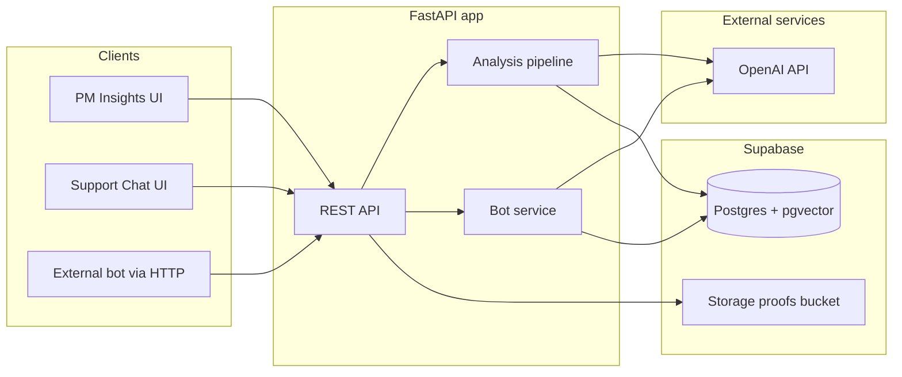
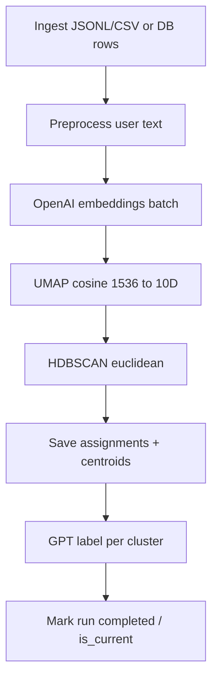
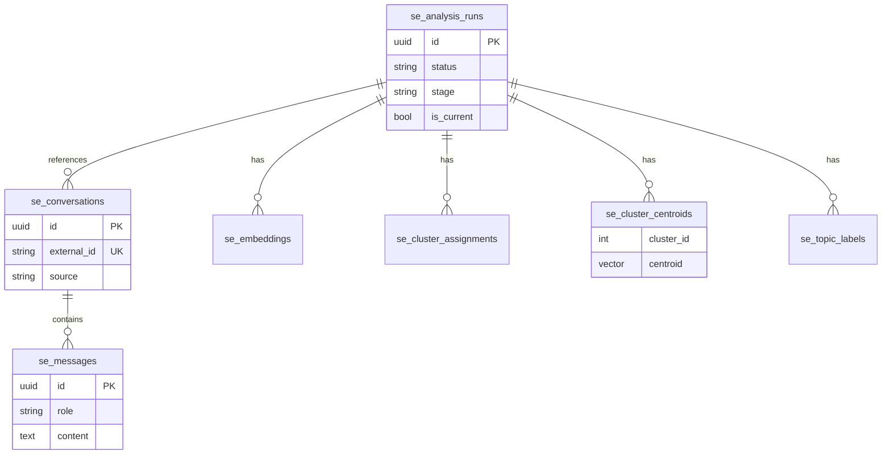
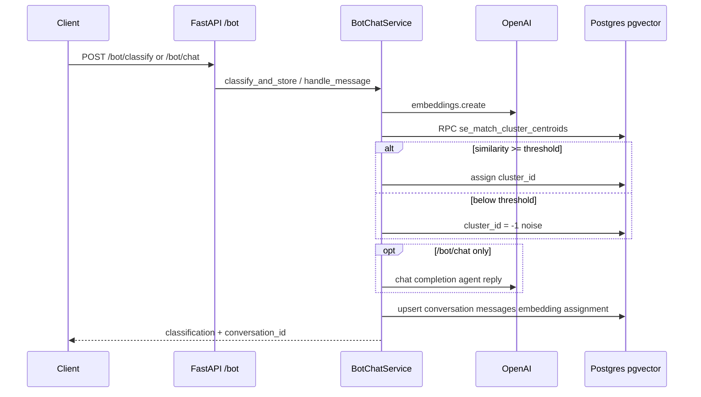
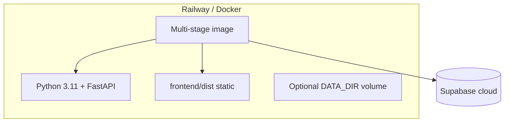

# Architecture

Short reference for reviewers. Deeper rationale: [REASONING.md](./REASONING.md).

---

## System context

| Layer | Tech | Role |
|-------|------|------|
| UI | React + Vite | Insights dashboard, chat demo, `/integrate` docs |
| API | FastAPI | Orchestration, background jobs, OpenAPI at `/docs` |
| ML | UMAP, HDBSCAN, OpenAI embeddings | Batch topic discovery |
| Data | Supabase Postgres + pgvector + Storage | Durable state and similarity search |

---

## Batch analysis pipeline

Triggered by `POST /analyze`, `POST /analyze/sample`, or `POST /analyze/upload`. Runs in a **background thread**; status via `GET /pipeline/status`.

**Read path for PM Insights:** resolve current `analysis_run_id` → load topics, assignments, counts.

**Write path for uploads:** Storage `proofs/uploads/...` + upsert conversations/messages → start pipeline on temp JSONL path.

---

## Real-time bot path

For integrators and the Support Chat UI.

| Endpoint | Persists | Agent reply |
|----------|----------|---------------|
| `POST /bot/classify` | Yes | No |
| `POST /bot/chat` | Yes | Yes |
| `GET /bot/status` | — | Readiness check |
| `GET /bot/history` | — | Recent `source=bot` turns |

Classification uses **cosine similarity** to stored centroids (`1 - (centroid <=> query)`), not re-running UMAP/HDBSCAN online.

---

## Deployment shape

- **Dockerfile:** build React → copy `dist` → run `uvicorn` on `$PORT`.
- **Required env:** `OPENAI_API_KEY`, `SUPABASE_URL`, `SUPABASE_SERVICE_ROLE_KEY`.
- **Bundled sample:** `data/sample_conversations.jsonl` via `POST /analyze/sample`.

---

## Module map

| Path | Responsibility |
|------|----------------|
| `app/ingest/` | JSONL/CSV load, user-text preprocessing |
| `app/embeddings/` | OpenAI embedder, batching, retries |
| `app/clustering/` | UMAP + HDBSCAN; nearest-centroid classify |
| `app/labeling/` | GPT topic names and severity |
| `app/db/` | Supabase repository, RPC classify |
| `app/api/` | Routes, pipeline, job runner, bot, uploads |
| `app/jobs/` | Daily re-analysis script hook |
| `frontend/` | PM Insights, Bot, Integration docs SPAs |
| `supabase/migrations/` | Schema, indexes, RPCs, RLS |

---

## API surface (evaluation focus)

| Area | Paths |
|------|--------|
| Pipeline | `/analyze`, `/analyze/sample`, `/analyze/upload`, `/pipeline/status`, `/insights` |
| Bot integration | `/bot/status`, `/bot/classify`, `/bot/chat`, `/bot/history`, `/bot/docs` |
| Ops | `/health`, `/data/reset` |
| Docs UI | `/integrate` (human), `/docs` (OpenAPI) |

---

## Security notes (Phase 1)

- CORS is permissive for demo UX; production would add auth and tighten origins.
- Service role key is **server-only**; never shipped to the browser.
- RLS policies exist in migrations; backend uses service role for app writes.

See [REASONING.md](./REASONING.md) for rejected alternatives and scaling follow-ups.
