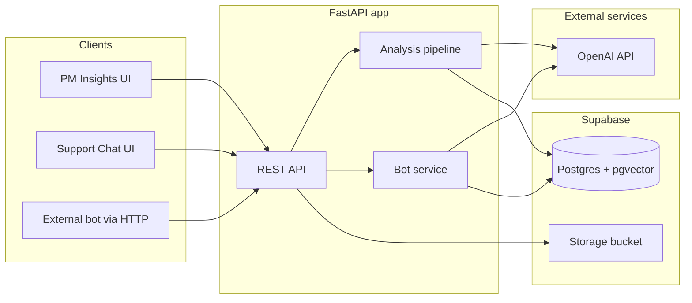
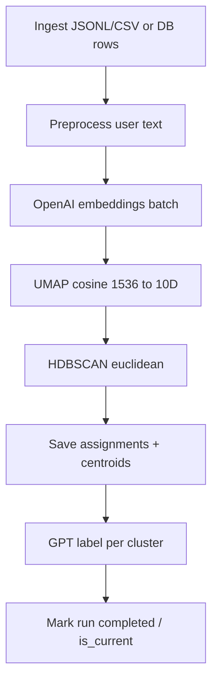

# REASONING.md

Design decisions for the Sentiment Engine
## 1. Database: Supabase PostgreSQL
Because free to use and I had it setup for my other projects. 

On a serious note, Postgres is performant and robust and I would have used that only even for production grade system

## 2. Vector Search: pgvector
For this demo project, I didn't want to add another dependency. So I used pgvector. But for production system, I would have gone for qdrant or pinecone vector databases because they are efficient for large scale search.

## 3. Why HDBSCAN for clustering?

Alternatives possible:  K-means, pure LLM based clustering
In K-means, you need to specify K and when it comes to chat data for different systems, we don't have K. So, we needed an algo which can work without specifying K.

Pure LLM based clustering would have been more expensive and unstable. It will be hard to reproduce same clusters because of non-deterministic nature of LLMs

## 4. How new messages are clustered in real time?
A nearest cluster is found for new messages and if the similarity is >55% it is assigned that cluster otherwise it is put into unknown category cluster. Then daily reclustering happens at midnight through cronjob.

## 5. Why UMAP before HDBSCAN?
In high dimensional space, structure is not visible because of huge distances between points. We need to represent it to appropriate dimensions so that structure can be visible.

## 6. What would I do different if given a month?
Nowadays, a lot can be done in a month.
1. Test the clustering quality on different parameters of HDBSCAN from noise_ratio, cluster_persistance, manual checking of text clustered under different clusters. Clustering eval pipeline.
2. Right now, I am determining simple sentiment. But we can further categorize into different emotions.
3. On platform, provide the API keys for integration into user's present systems.
4. Scalable Async Processing of New messages using queues implemented with Kafka. Orchasteration of workers using Temporal.
5. More features on platform for product managers - rename clustering, manual cluster creation by marking sample conversations.
6. Temporal Intelligence of issues. With time, some issues will reduce and some new issues will come. So, a time based representation of issues.

## Architecure

